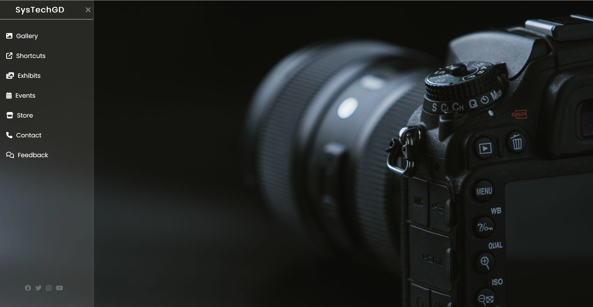

# **Mini Project: Responsive Sidebar Menu**

This is a simple **HTML** and **CSS** project that demonstrates the creation of a **responsive sidebar menu** with interactive elements. The sidebar slides in and out, revealing navigation links and social media icons. This project utilizes only HTML and CSS to provide a smooth, modern design with hover effects and transitions.

---

---
### **Features** ✨

- **Responsive Sidebar:** A sleek vertical navigation menu with icons for sections like **Gallery**, **Shortcuts**, **Exhibits**, **Events**, **Store**, **Contact**, and **Feedback**.
- **Toggle Mechanism:** The sidebar can be toggled open or closed using a **hamburger menu** with a smooth transition.
- **Background Image:** Full-screen background image sets an aesthetic tone for the layout.
- **Hover Effects:** Menu items and social media icons have hover effects to enhance user interaction.
- **Social Media Links:** Direct links to popular social media platforms (**Facebook**, **Twitter**, **Instagram**, **YouTube**).
- **Modern Fonts & Icons:** Clean typography from **Google Fonts** and **Font Awesome** icons for better design and functionality.

---

### **Technologies Used** 🛠️

- **HTML**: Defines the structure and content of the sidebar, links, and elements.
- **CSS**: Styling for layout, background, fonts, and hover effects.
- **Font Awesome**: Provides vector icons for menu items and social media links.
- **Google Fonts**: "Poppins" font for a modern and readable appearance.

---

### **How to Run the Project** 🚀

1. **Download** or **clone** the project repository to your local machine.
2. Open the `index.html` file in any modern browser (e.g., **Google Chrome**, **Firefox**).
3. The sidebar should appear, and you'll be able to interact with the toggle mechanism.

---

### **File Structure** 📂

---

### **Customization Options** ✨

- **Change the Background**: Replace `photo.jpg` with your own background image by modifying the `background-image` property in the CSS.
- **Add More Links**: To add more items to the menu, copy and paste a `<li>` element inside the `<ul>` in the `menu` section of `index.html` and customize as needed.
- **Modify Colors and Fonts**: Adjust the colors and fonts in the `style.css` file to fit your branding or personal style.

---

### **Preview** 🖥️

To see the project in action, just open the `index.html` file in your browser. The sidebar should slide in when you click the hamburger menu, and the background image will fill the screen.

---
### **Conclusion** 🎉

This project showcases how to create a **responsive sidebar** with a modern look using only **HTML** and **CSS**. It's a great starting point for those learning web design and can be extended with additional features or used as a template for more complex projects.

---

Feel free to fork this repository, customize it, and use it in your own projects. If you have any questions or suggestions, feel free to reach out! 😊
